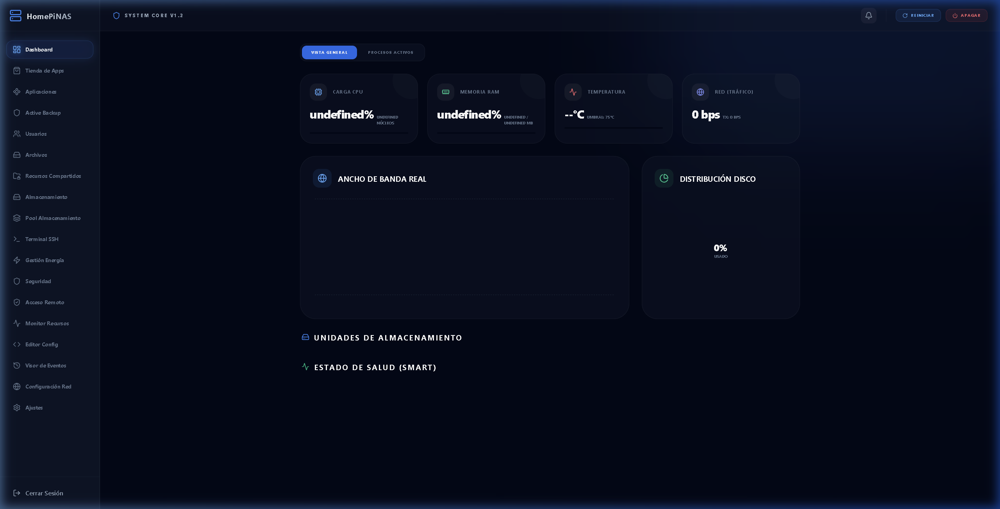
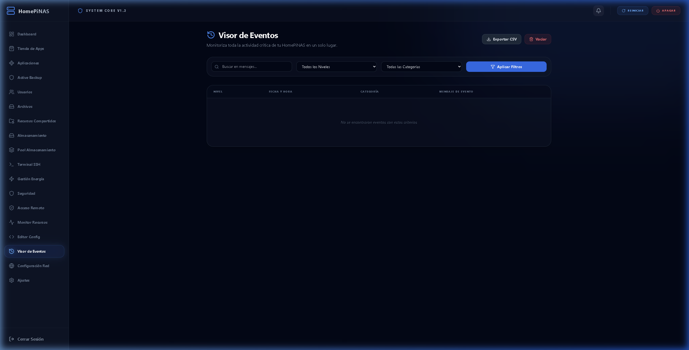

# 🏠 HomeVault - High-Performance Raspberry Pi NAS & Home Server

[](LICENSE)
[](https://github.com/virtuspro28/homevault)

HomeVault is an all-in-one, high-performance dashboard designed specifically for the Raspberry Pi ecosystem. It bridges the gap between raw command-line administration and high-end enterprise NAS solutions, offering a beautiful glassmorphism interface coupled with robust system control.

---

## 📸 Visual Showcase

### Interactive Dashboard


*Main panel showing real-time hardware telemetry and storage status.*

### Advanced Telemetry
| Power Monitoring | Event Log Viewer |
| :---: | :---: |
|  |  |

---

## 🚀 Key Features

### 🐳 App Center
- **Docker Management**: Deploy and manage containers with a single click.
- **NAS App Store**: Pre-configured templates for Plex, Pi-hole, AdGuard, and more.
- **Terminal Integration**: Integrated shell for advanced troubleshooting.

### 💾 Smart Storage
- **Pool Management**: Seamless integration with **MergerFS** and **SnapRAID**.
- **Disk Health**: Real-time **S.M.A.R.T.** data and temperature monitoring.
- **File Station**: intuitive web-based file manager with dual-pane view.

### 🌡️ Hardware Telemetry (Pro-Grade)
- **Power Monitor**: Real-time Voltage/Amperage/Wattage tracking (INA238).
- **Active Cooling**: Dynamic PWM fan curves based on CPU temperature (EMC2305).
- **UPS Integration**: Safe shutdown protocols and energy event logging.

### 🔄 Backup & Sync
- **3-2-1 Rule Engine**: Schedule local, external (USB), and remote backups.
- **Cloud Manager**: Mount Google Drive, Dropbox, or OneDrive via **RClone**.
- **Active Backup**: Agent-based protection for your remote machines.

### 🛡️ Security & Connectivity
- **Glassmorphism Firewall**: Manage Fail2Ban and Iptables visually.
- **VPN Control**: One-click WireGuard tunnel management.
- **Nginx Reverse Proxy**: Secure your apps with domains and SSL.

---

## 🛠️ Installation

Deploy HomeVault on your Raspberry Pi (Debian/Raspberry Pi OS) with the **One-Command Master Installer**:

```bash
# Sencillo (si ya tienes sudo)
curl -sSL https://raw.githubusercontent.com/virtuspro28/homevault/main/install.sh | sudo bash

# Si eres ROOT directamente (y no tienes sudo instalado)
curl -sSL https://raw.githubusercontent.com/virtuspro28/homevault/main/install.sh | bash
```


### Manual Setup

1. **Clone the repo**:
   ```bash
   git clone https://github.com/virtuspro28/homevault.git
   cd homevault
   ```

2. **Configure environment**:
   ```bash
   cp .env.example .env
   # Edit .env with your specific settings
   ```

3. **Install & Build**:
   ```bash
   npm install
   npm run build:all
   ```

---

## 🛠️ Tech Stack
- **Backend**: Node.js, Express, Prisma (SQLite).
- **Frontend**: React, Vite, TailwindCSS (for UI elements), Framer Motion.
- **Communication**: Socket.io for real-time telemetry.

---

## ⚖️ License
Distributed under the MIT License. See `LICENSE` for more information.

*Crafted with 💙 for the Self-Hosting Community.*
